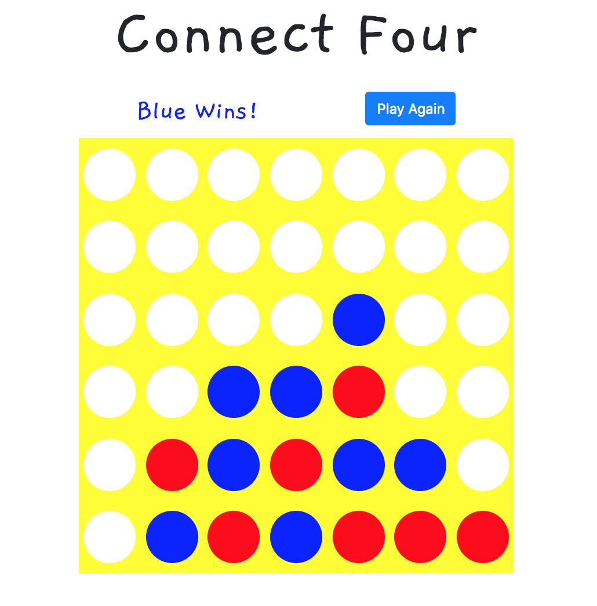

## Connect Four
> Classic game implemented with react/redux and a node server.

## Video Sample

[](https://www.youtube.com/watch?v=fNkz_jUvDYA&feature=youtu.be)
## Usage

Clone repo:
```
git clone https://github.com/borerjason/connect-four.git  
```

cd into directory & install dependencies:
```
npm install
```

Start server:
```
npm start
```

Navigate to:
```
localhost:3000
```

## Main Technologies
  - react  
  - redux  
  - styled-components  
  - node/express

## App Design:

1. App
   - Summmary: Renders header and board components on start.   
      
2. Header
   - Summary: Renders who's turn it is, who the winner is, and if user wants to start a new game.  
   - Props:
     - current player
     - isWinner   
     - reset board (fcn)  
  
3. Board
   - Summary: Renders board slots  
   - State:  
     - Board array  
  
4. Slot  
   - Summary: Validates move, renders color in slot and updates slot value in board.  
   - Props:  
     - current player 
     - isWinner  
     - slot id  
     - Update board (fcn)

